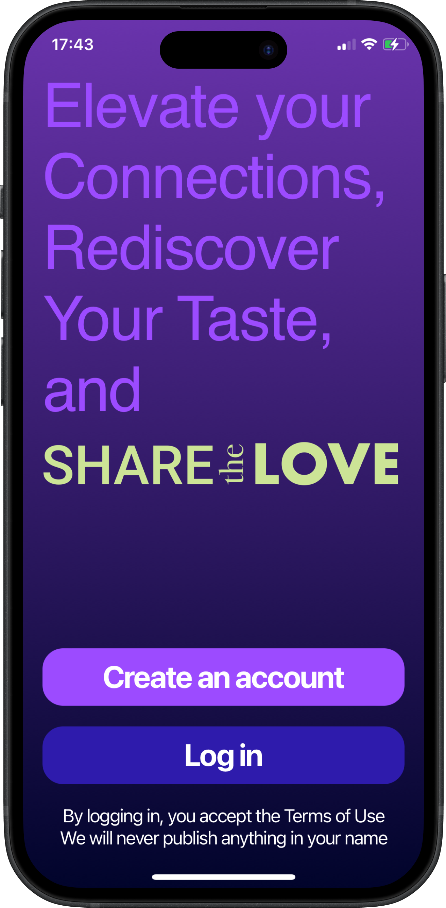
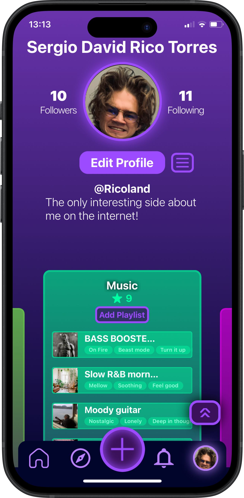
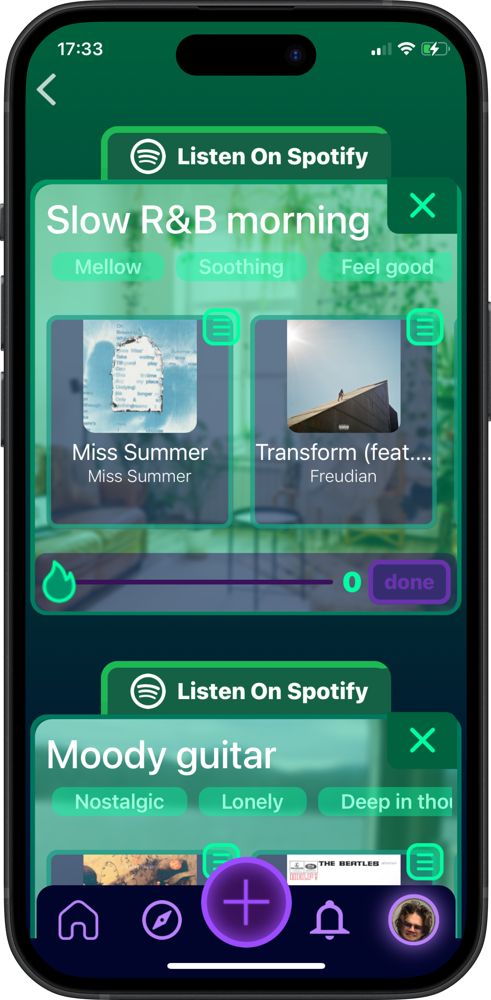
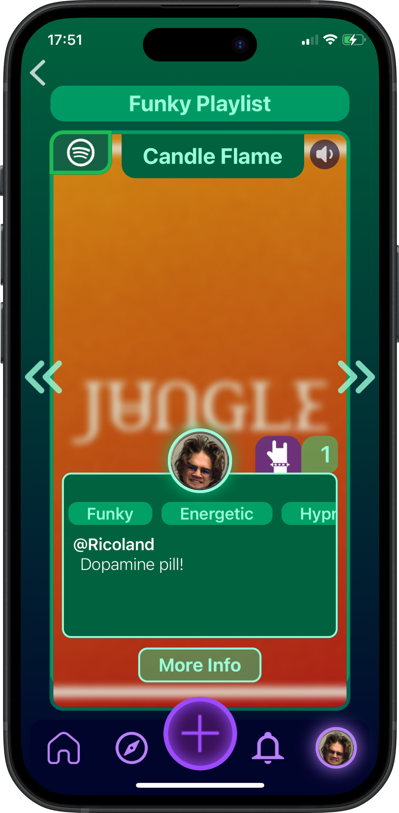

# Share The Love MVP - A Taste-Based Social Network 🎶🎬🎙️

**Connecting people through their shared love of music, films, and podcasts.**  
A social media prototype that allows users to create taste-based profiles, post about their favorite content, and interact with friends via a dynamic feed.

## 📌 Features
- **User Profiles**: Users can showcase their taste in **Music, Films/TV Shows, and Podcasts**.
- **Post & Share**: Add posts with songs, movies, or podcast episodes, including descriptions.
- **Dynamic Feed**: View recent posts from friends in a personalized timeline.
- **Profile Search**: Discover and connect with friends through their shared interests.
- **Authentication**: Secure sign-in and user management with Firebase Auth.
- **Cloud Database**: Posts and profiles stored and retrieved via Firebase Firestore.
- **User-Friendly UI**: Clean and responsive design built with React Native & Expo.

## 🛠️ Tech Stack
- **Frontend**: React Native + Expo
- **Backend**: Firebase (Authentication, Firestore Database, Storage)
- **UI/UX Design**: Figma (for prototyping)
- **Development Tools**: JavaScript, TypeScript, Node.js

## 📸 Screenshots

### Landing     User Profile    Dynamic Feed    Playlists     Post  

## 🎥 Link to a Demo MVP Video (YouTube)
[Watch the Demo](https://youtube.com/shorts/iLLVMSlm3G8?feature=share)

## 📊 Pilot Test

Conducted an initial pilot test with 15 users to evaluate: 

✔️ Main concept of exploring and connecting through the intricacies of human taste

✔️ User engagement with posts & profiles

✔️ Effectiveness of recommendation algorithms

✔️ Potential improvements for better interaction

## 📍 Future Improvements

🔍 Better search & discovery (recommendations based on subjective emotional values)

💬 Enhanced social features (notifications, friend suggestions)

🎨 Improved UI/UX based on pilot feedback

## 🔗 Want to Connect?
We're actively looking for Testers, Teammates, Partners and Investors! So if you're interested hit me up!

💼 LinkedIn:[Sergio David Rico Torres](linkedin.com/in/sergio-david-rico-torres-b187781ba)

📧 Email: sharethelove.03.12.2023@gmail.com
